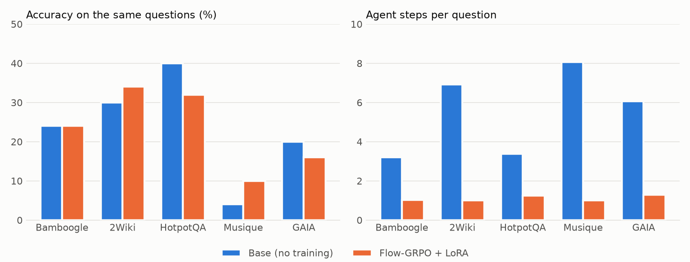

# Base vs Flow-GRPO LoRA on the same questions (run `fair50`)

Qwen3.5-0.8B as the AgentFlow planner, on the first 50 questions of each benchmark. Both models ran with the agent settings of `test/run_lora_bench.sh`, the same serving code (`serve_lora_local.py`, bf16, greedy decoding, thinking off), the same tools and the same judge. How the run was set up and why: [`README.md`](README.md).

## Accuracy

| Benchmark | Questions | Base | LoRA | Change | LoRA-only correct | Base-only correct | McNemar p |
|---|---:|---:|---:|---:|---:|---:|---:|
| bamboogle | 50 | 24.0 | 24.0 | +0.0 | 9 | 9 | 1.00 |
| 2wiki | 50 | 30.0 | 34.0 | +4.0 | 10 | 8 | 0.81 |
| hotpotqa | 50 | 40.0 | 32.0 | -8.0 | 6 | 10 | 0.45 |
| musique | 50 | 4.0 | 10.0 | +6.0 | 4 | 1 | 0.38 |
| gaia | 50 | 20.0 | 16.0 | -4.0 | 5 | 7 | 0.77 |
| **all** | 250 | 23.6 | 23.2 | -0.4 | 34 | 35 | 1.00 |

*Change* is LoRA minus base, in percentage points. *LoRA-only correct* and *Base-only correct* count the questions only one of the two models got right. The exact McNemar test gives the probability of a split at least that uneven if both models were equally good.

## How the planners behave

| Benchmark | Steps per question (base / LoRA) | Answered after one step | Tool selections AgentFlow could not use | Seconds per question |
|---|---:|---:|---:|---:|
| bamboogle | 3.2 / 1.0 | 54% / 98% | 44% / 16% | 131 / 30 |
| 2wiki | 6.9 / 1.0 | 20% / 100% | 55% / 0% | 152 / 40 |
| hotpotqa | 3.4 / 1.2 | 40% / 94% | 36% / 19% | 163 / 34 |
| musique | 8.1 / 1.0 | 10% / 100% | 53% / 2% | 247 / 44 |
| gaia | 6.1 / 1.3 | 24% / 96% | 49% / 8% | 232 / 49 |
| **all** | 5.5 / 1.1 | 30% / 98% | 49% / 9% | 185 / 39 |

Each cell shows base / LoRA.

- *Steps per question*: tool calls the agent made, with a limit of 10.
- *Tool selections AgentFlow could not use*: the planner named no tool, or a name the framework could not match. This includes a valid name wrapped in backticks, which AgentFlow's parser rejects. The step is then wasted.
- *Seconds per question*: wall time on one NVIDIA L4, including tool calls.

## Setup

- **Weights:** `Qwen/Qwen3.5-0.8B` at revision `2fc06364715b967f1860aea9cf38778875588b17`. The LoRA `results/final_qwen35_lora` is merged into the same weights in float32. Both checkpoints are served in bf16 and written by `eval/build_models.py`.
- **Tokenizer:** the base model's, for both. The tokenizer saved with the adapter renders the same prompts.
- **Questions:** upstream AgentFlow `b940064`, SHA-256 checked.
- **Tools:**
  - Base_Generator (gpt-4o-mini).
  - Google Search (`gemini-3.5-flash-lite` with Google Search grounding).
  - Wikipedia search: see the known issue below.
- **Judge:** gpt-4o via `test/calculate_score_unified.py --judge_prompt open_qa`.
- **Hardware:** NVIDIA L4 on Modal. The run finished on 2026-09-28. Planner time was 15.6 GPU-hours, not counting container start-up or interrupted work.

## Notes

- **Questions still showing a tool error after 3 attempts:** Base gaia #4 (tool_exception), LoRA gaia #4 (tool_exception), LoRA gaia #26 (tool_exception). They are scored like every other question.
- **Known issue: the Wikipedia tool.** It never reads page text. Upstream AgentFlow's `Wikipedia_Search_Tool` does not store its `model_string`, so creating its page reader fails (`Error creating Web RAG tool` in the logs) and the tool returns search titles only. This is the same for both models and in the team's runs, and was kept for comparability.
- **Sample size:** 50 questions per benchmark is small. With the 5–18 discordant questions seen here, a benchmark needs a difference of roughly 15–20 points before the McNemar test puts it below p = 0.05.
